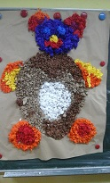
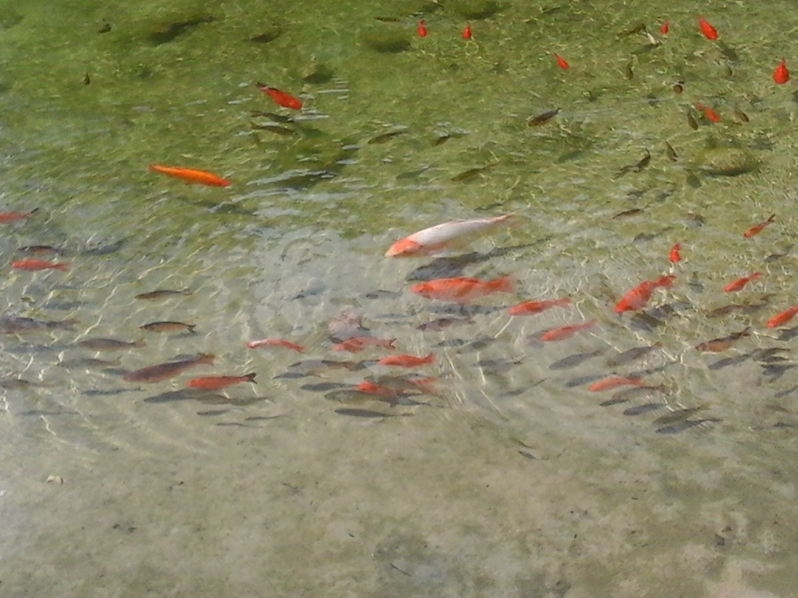
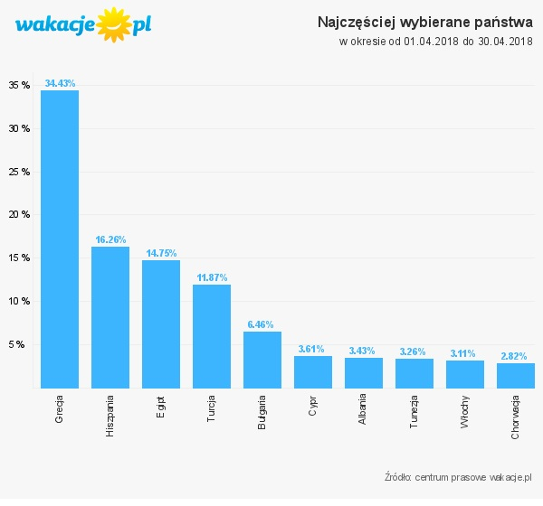

*_moje portfolio_* https://justynapodolska.github.io/Zaliczenie/[]

# _Gdzie spędzimy wakacje?_ 

## Atrakcje turystyczne w różnych regionach Polski

|===
|Pomorze|Kołobrzeg
|Mazury|Olsztyn
|Śląsk|Wrocław
|Góry|Zakopane
|Kaszuby|Kartuzy
|===

 
Polska Atrakcyjna zabierze Cię w podróż, jakiej nie zapomnisz! Przed Wami ponad 100 inspirujących planów wycieczek od Bałtyku aż po Tatry: szlaki turystyczne pokazujące piękno polskiej przyrody, malownicze miasta i gminy, rozmach ciekawych atrakcji kulturalnych, wędrówki górskie, sporty wodne na mazurskich jeziorach oraz jod i witamina D nadmorskich plaż. Nasze propozycje to połączenie atrakcji, które uczą, bawią i dają niezapomniane wrażenia ze wspólnie spędzonego czasu. Daj się przekonać, że Polska jest atrakcyjna! 

== Źródła fotografii:

* http://www.ksiegarnia.slupsk.edu.pl/468-578-thickbox/gmina-glowczyce-pocztowka.jpg>
* http://apartamenty-kg.pl/wp-content/uploads/2015/04/kgg-0x0.jpg
* http://www.national-geographic.pl/media/cache/default_view/uploads/media/default/0011/33/87d954d67d3e53592e4cd33074d43b23d9984dee.jpeg
* https://podroze.smcloud.net/t/image/t/129325/w-kopalni-guido-w-podziemnym_332545.jpg
* https://podroze.smcloud.net/t/photos/t/132345/atrakcje-zakopanego-top-10_1083807.jpg
* https://www.wakacje.pl/centrum-prasowe/statystyki.png?panstwa

